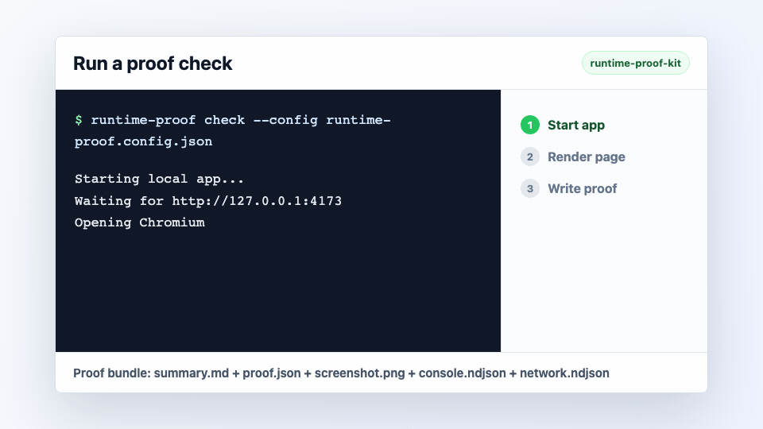
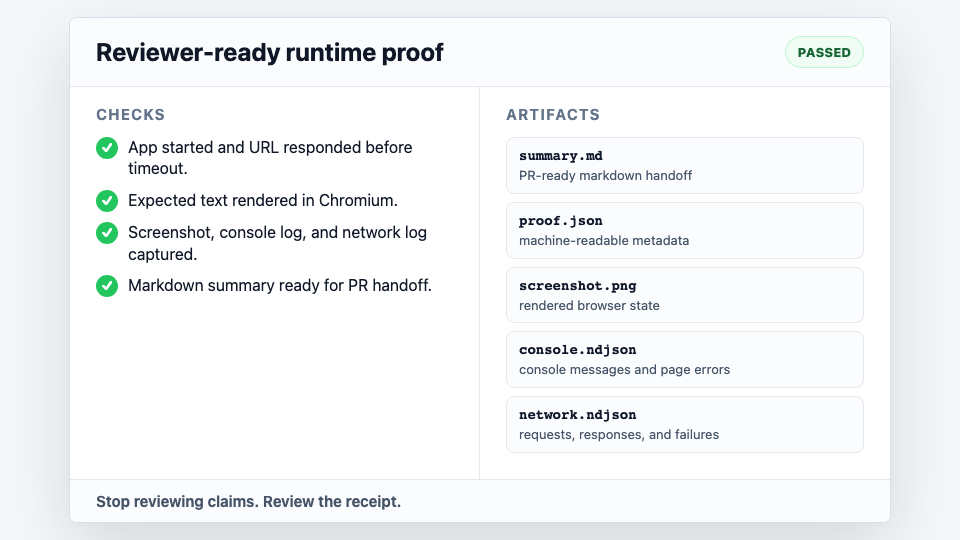
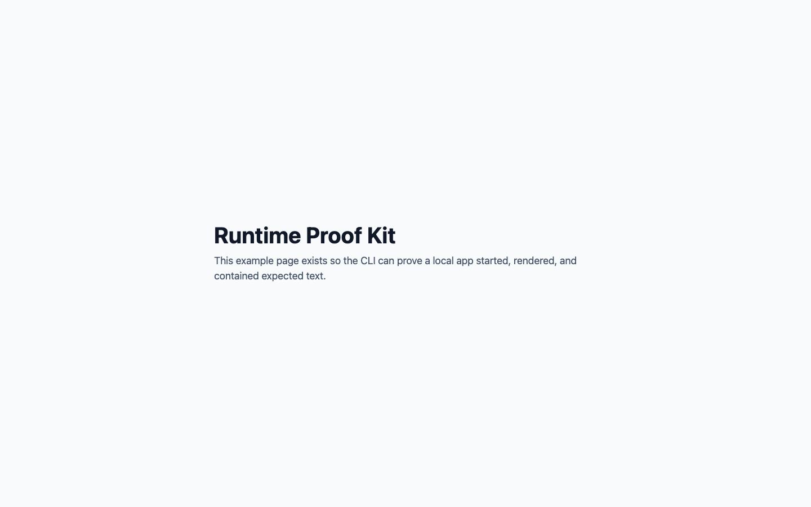

# runtime-proof-kit

[](https://www.npmjs.com/package/runtime-proof-kit)
[](https://github.com/ozbayorcun/runtime-proof-kit/actions/workflows/ci.yml)
[](LICENSE)
[](package.json)
[](https://playwright.dev/)

Runtime proof for AI-generated code.

Stop accepting "it works on my machine" from coding agents. `runtime-proof-kit` starts your app, opens it in a real browser, checks user-visible text, captures screenshots and browser logs, and writes a PR-ready proof bundle that another human or agent can inspect.

It is built for AI-assisted coding, agent handoffs, CI smoke checks, and lightweight QA where "the code changed" is less useful than "the app started, rendered, and left evidence."



## Guides

- [AI coding agent verification](docs/ai-agent-workflows.md): use runtime proof as the handoff receipt for AI-generated code.
- [GitHub Actions runtime proof](docs/github-actions.md): add screenshots, browser logs, and `summary.md` to pull request CI.
- [Playwright smoke test CLI vs runtime proof](docs/playwright-vs-runtime-proof.md): where this fits next to a full Playwright test suite.
- [Next.js example](examples/nextjs/README.md) and [Vite example](examples/vite/README.md): starter configs for common app stacks.

## Why It Exists

AI coding agents can ship changes quickly, but they often stop at "tests passed" or "implementation complete." Runtime proof adds the missing receipt:

| Instead of accepting... | Ask for... |
| --- | --- |
| "I implemented it" | A browser screenshot of the rendered page |
| "The app should run" | A URL reachability check with timeout evidence |
| "The UI is there" | Expected user-facing text assertions |
| "No obvious errors" | Captured console and network event logs |
| "Ready for review" | `proof.json` and `summary.md` attached to the handoff |

Use it when you want an agent, teammate, or CI job to prove that a web app actually starts and renders the thing it claims to have changed.

## Get Started

Pick the fastest path:

| Workflow | Use when | Command |
| --- | --- | --- |
| Prove a URL once | You need a quick receipt | `npx --yes runtime-proof-kit check --url https://example.com --expect-text "Example Domain"` |
| Add proof to a repo | You want repeatable local or CI checks | `npm install --save-dev runtime-proof-kit` |

Run a one-off proof from npm:

```bash
npx --yes runtime-proof-kit check \
  --url https://example.com \
  --expect-text "Example Domain"
```

After installing in a project:

```bash
npm install --save-dev runtime-proof-kit
npx runtime-proof check --url https://example.com --expect-text "Example Domain"
```

That creates a proof bundle:

```text
proof/
  runtime-proof/
    proof.json
    summary.md
    screenshot.png
    console.ndjson
    network.ndjson
```

## What Reviewers See

`runtime-proof-kit` turns a coding-agent claim into a small evidence bundle a reviewer can scan quickly:



- `summary.md`: PR-ready markdown with status, URL, checks, and artifact paths.
- `proof.json`: machine-readable proof metadata for agents and CI.
- `screenshot.png`: the rendered browser state.
- `console.ndjson`: browser console messages and page errors.
- `network.ndjson`: requests, responses, and failed requests.

## Check A Local App

Start a local app, wait for it to respond, assert page text, and keep screenshots/logs for the handoff:

```bash
npx runtime-proof check \
  --name basic-smoke \
  --command "npm run dev" \
  --url http://127.0.0.1:3000 \
  --expect-text "Dashboard" \
  --fail-on-console-error
```

For this repository's bundled example:

```bash
npm install
npm run proof:example
```

## Use A Config File

Keep repeatable checks in JSON:

```bash
npx runtime-proof check --config runtime-proof.config.json
```

```json
{
  "name": "basic-smoke",
  "command": "node examples/basic/server.mjs",
  "url": "http://127.0.0.1:4173",
  "expectText": ["Runtime Proof Kit", "expected text"],
  "failOnConsoleError": true,
  "outDir": "proof",
  "timeoutMs": 30000,
  "viewport": {
    "width": 1440,
    "height": 900
  }
}
```

CLI flags override config values.

## Run Multiple Checks

Use `checks` when one proof should cover more than one route, viewport, or page assertion. Top-level values act as defaults; each check can override `url`, `expectText`, `viewport`, `timeoutMs`, or `failOnConsoleError`.

```json
{
  "name": "multi-smoke",
  "command": "npm run dev",
  "url": "http://127.0.0.1:3000",
  "failOnConsoleError": true,
  "checks": [
    {
      "name": "desktop-home",
      "expectText": ["Dashboard"],
      "viewport": { "width": 1440, "height": 900 }
    },
    {
      "name": "mobile-home",
      "expectText": ["Dashboard"],
      "viewport": { "width": 390, "height": 844 }
    },
    {
      "name": "health",
      "url": "http://127.0.0.1:3000/health",
      "expectText": ["ok"]
    }
  ]
}
```

Run it the same way:

```bash
npx runtime-proof check --config runtime-proof.config.json
```

That writes an aggregate suite report plus one proof bundle per check:

```text
proof/
  multi-smoke/
    proof.json
    summary.md
    desktop-home/
      proof.json
      summary.md
      screenshot.png
      console.ndjson
      network.ndjson
    mobile-home/
      proof.json
      summary.md
      screenshot.png
      console.ndjson
      network.ndjson
```

## Initialize A Project

Generate a starter config and GitHub Actions workflow:

```bash
npx --yes runtime-proof-kit init --template next
```

Templates:

| Template | Generated URL | Generated command |
| --- | --- | --- |
| `generic` | `http://127.0.0.1:3000` | `npm run dev` |
| `next` | `http://127.0.0.1:3000` | `npm run dev -- --hostname 127.0.0.1 --port 3000` |
| `vite` | `http://127.0.0.1:5173` | `npm run dev -- --host 127.0.0.1 --port 5173` |

Then edit `runtime-proof.config.json` and replace the placeholder expected text with something visible on your page.

Useful options:

```bash
npx --yes runtime-proof-kit init --template vite --expect-text "Dashboard" --force
npx --yes runtime-proof-kit init --no-ci
```

## Copy-Paste CI

Add `runtime-proof.config.json` to your repo:

```json
{
  "name": "pr-proof",
  "command": "npm run dev",
  "url": "http://127.0.0.1:3000",
  "expectText": ["Dashboard"],
  "failOnConsoleError": true,
  "outDir": "proof",
  "timeoutMs": 30000
}
```

Then create `.github/workflows/runtime-proof.yml`:

```yaml
name: Runtime proof

on:
  pull_request:
  workflow_dispatch:

jobs:
  runtime-proof:
    runs-on: ubuntu-latest

    steps:
      - uses: actions/checkout@v4

      - uses: actions/setup-node@v4
        with:
          node-version: 22
          cache: npm

      - run: npm ci

      - run: npx playwright install --with-deps chromium

      - run: npx runtime-proof check --config runtime-proof.config.json

      - uses: actions/upload-artifact@v4
        if: always()
        with:
          name: runtime-proof
          path: proof/
```

For coding-agent repositories, add this to your PR template or agent instructions:

```md
For web-app changes, run:

`npx runtime-proof check --config runtime-proof.config.json`

Include the generated `summary.md`, screenshot path, console log path, and network log path before marking the work complete.
```

See [GitHub Actions runtime proof](docs/github-actions.md) for multi-route checks and reviewer guidance.

## CLI Reference

```text
runtime-proof check --url <url> [options]
runtime-proof check --config runtime-proof.config.json
runtime-proof init [options]

Options:
  --config <path>       JSON config file
  --command <cmd>       Command to start before checking the URL
  --expect-text <text>  Text that must appear on the page; repeatable
  --fail-on-console-error
                        Fail if the page logs a console error
  --name <name>         Proof run name, default: runtime-proof
  --out <dir>           Artifact directory, default: proof
  --timeout-ms <ms>     Startup/check timeout, default: 30000
  --viewport <WxH>      Browser viewport, default: 1440x900

Config:
  checks               Optional array of named checks for one multi-page proof run

Init Options:
  --template <name>     generic, next, or vite; default: generic
  --config <path>       Config file to write, default: runtime-proof.config.json
  --workflow <path>     CI workflow to write, default: .github/workflows/runtime-proof.yml
  --url <url>           Override the generated URL
  --command <cmd>       Override the generated dev command
  --expect-text <text>  Override generated expected text; repeatable
  --no-ci               Only write the config file
  --force               Overwrite generated files
```

## Proof Report

`proof.json` is designed for machines. `summary.md` is designed for PR comments, CI artifacts, and agent handoffs.
`console.ndjson` and `network.ndjson` are newline-delimited JSON streams for debugging browser console output, page errors, requests, responses, and failed requests.

Example `network.ndjson` lines:

```json
{"timestamp":"2026-06-09T04:02:43.069Z","event":"request","method":"GET","url":"http://127.0.0.1:4173/","resourceType":"document"}
{"timestamp":"2026-06-09T04:02:43.081Z","event":"response","method":"GET","url":"http://127.0.0.1:4173/","resourceType":"document","status":200,"statusText":"OK"}
```



Example `summary.md`:

```markdown
# Runtime Proof: basic-smoke

Status: PASSED
URL: http://127.0.0.1:4173
Duration: 1.42s

## Checks

- PASS url-reachable: http://127.0.0.1:4173 responded before timeout
- PASS screenshot: Captured screenshot.png
- PASS expect-text:Runtime Proof Kit: Found expected text: Runtime Proof Kit
```

```json
{
  "name": "basic-smoke",
  "status": "passed",
  "url": "http://127.0.0.1:4173",
  "checks": [
    {
      "name": "url-reachable",
      "status": "passed",
      "message": "http://127.0.0.1:4173 responded before timeout"
    },
    {
      "name": "screenshot",
      "status": "passed",
      "message": "Captured screenshot.png"
    }
  ],
  "artifacts": {
    "proof": "proof.json",
    "summary": "summary.md",
    "screenshot": "screenshot.png",
    "console": "console.ndjson",
    "network": "network.ndjson",
    "stdout": "stdout.log",
    "stderr": "stderr.log"
  }
}
```

## Development

```bash
npm install
npm run check
npm run proof:example
```

Regenerate the README screenshot and GIF:

```bash
npm run assets:readme
```

Proof bundles can include screenshots and logs. Review them before sharing publicly.

To try unreleased `main` before the next npm publish:

```bash
npm exec --yes --package github:ozbayorcun/runtime-proof-kit -- runtime-proof check --url https://example.com --expect-text "Example Domain"
```

## Roadmap

- Video capture for short walkthroughs
- Redaction rules for logs and screenshots

## License

MIT
